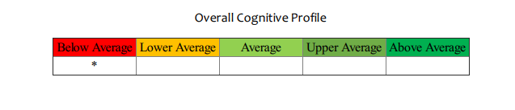
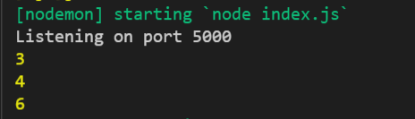

# EPZ_ReportGeneration

Module to generate reports

Technologies used:

1. React.js
2. > Nodej.s
   >

Main objective is to generate a pdf using nodejs.

The issue at hand failing to calculate the average of sten values which are in an array.

Inside: server/document/index.js

> That is where the code to design the pdf template is in. Look at line 145 that is where the code to calculate the average starts. The function '`calculateAverage`' is being called at line 199, and the value of the average is used inside the switch statement on line 200, which prints the star on a pdf depending on the value of the average.
>
> 
>
> Instead when l console.log(AverageSten) `it outputs the values of the array instead of the average :) and places  the star on the wrong position.`

```
 var allStens = [];

      allStens = candidate.sten;

      let arry = [];

      var smallA = arry.push(candidate.sten);

      function calculateAverage(array) {
         var total = 0;
         var count = 0;
         array.forEach(function (item, index) {
            total += item;
            count++;
         });
         var AverageSten = total / arry.length;

         //If l console.log(AverageSten) it outputs the values of the array instead of the average :)
         console.log(AverageSten); 

         return AverageSten;
      }
```

```


var aveSten = ${calculateAverage(arry)};
               switch(true) {
                  case  ((aveSten >= 1) && (aveSten <= 3.9)):
             

                     cell1 = document.getElementById("cell1").innerHTML = "*";
             
                     break;
         
                  case ((aveSten >= 4) && (aveSten <= 4.9)):         
                     cell2 = document.getElementById("cell2").innerHTML = "*";
                     break;
                  case ((aveSten >= 5) && (aveSten <= 6.9)):
          
                     cell3 = document.getElementById("cell3").innerHTML = "*";
                     break;  
                  case ((aveSten >= 7) && (aveSten <= 7.9)):
                     cell4 = document.getElementById("cell4").innerHTML = "*";
                     break;

                  case ((aveSten >= 8) && (aveSten <= 10)):
                     cell5 = document.getElementById("cell5").innerHTML = "*";
                     break;

                  default:
                     console.log("");
                     break;
               }
```
